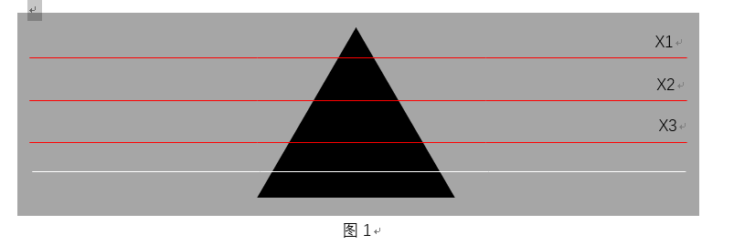
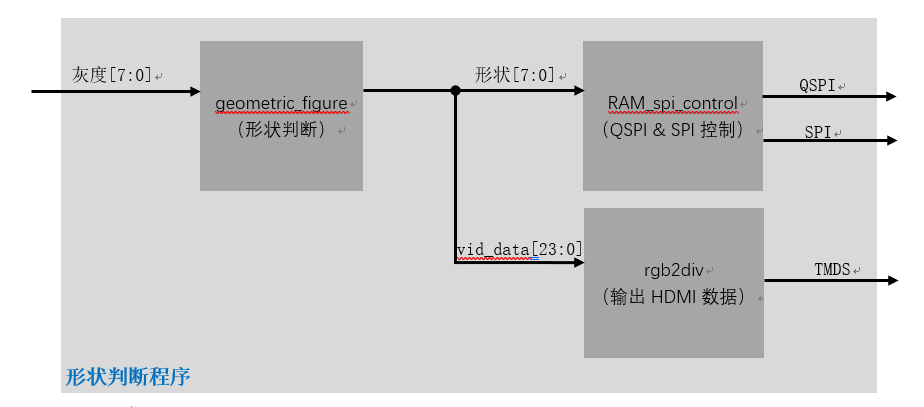
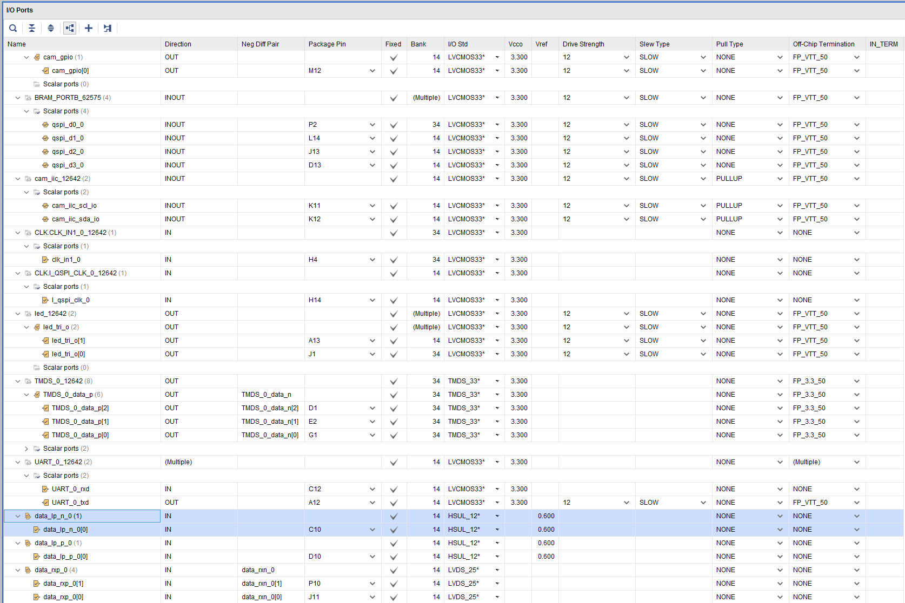
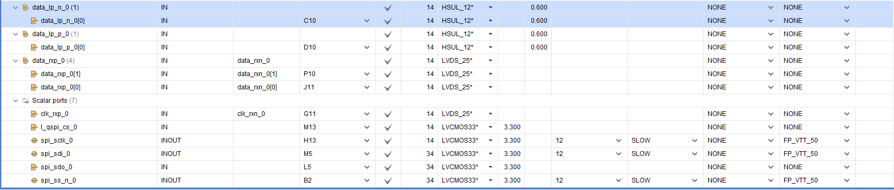

# 图形识别项目使用说明书

## 程序功能

 本设计的主要功能是对三角形、圆形、矩形这三种图形进行识别，并将识别后的数据通过SPI通信协议传输给Arduino。程序运行后会在显示器显示三条红色标志线，将需要检测的图形放入标志线中间即可检测出相应的形状，具体使用方法本文以三角形举例：见下图。

第四条线的作用是指示识别就多,红色、白色、浅蓝色分别代表圆形三角形和矩形。同时在Arduino端发送地址0x82即可输出8bit数据，也可以通过QSPI传输到ESP32上，具体的图形和数据、颜色对应表见1.2对照表说明。

 本设计算法采用全流水，每秒识别速度超过30帧，能够进行图像的实时处理。

## 数据、颜色对应表说明

### 数据表

| **数据**    | **形状** |
| ----------- | -------- |
| 0b1111_0000 | 矩形     |
| 0b1100_1100 | 圆形     |
| 0b1100_0011 | 三角形   |

图像其他形状时，将会记录上次测量的形状数据。

### 显示器颜色

显示器上将会在数据读取线下面一行出现颜色可变的彩条。

| **颜色** | **图形** |
| -------- | -------- |
| 浅蓝色   | 矩形     |
| 红色     | 圆形     |
| 白色     | 三角形   |

## 数据读取指令表

### ESP32通过QSPI读取指令表

控制寄存器为QSPI对应FPGA端RAM地址0 的 8位寄存器 D[7:0]

| **地址**      | **名称** | **类型** | **描述**                                     |
| ------------- | -------- | -------- | -------------------------------------------- |
| 32’h0000_0001 | control  | 输入     | 发送最后一位地址为1即可， 会输出8bit形状数据 |

### Arduino通过SPI读取指令表

所有的寄存器都为8位

| **地址** | **名称**     | **类型** | **描述**              |
| -------- | ------------ | -------- | --------------------- |
| 0x82     | GEO_DATA_LOW | 输出     | 输出形状数据：8位数据 |

当收到命令0x82时，会输出形状数据：8位数据。

## 程序架构

**geometric_figure**模块的主要功能是形状判断，对于图形,矩形、三角形、圆形，三者在线条X1、X2、X3三条线上的像素点位置和多少各不相同。利用此性质对三条线上的像素点进行计数，然后比较三者大小关系，通过增加阈值和绝对值大小判断相对应的图形。

若Y1=ADD（X1）、Y2=ADD（X2）、Y3=ADD（X3）表示三条线上相应的深色像素点个数，

1：D1=Y1 – Y2、D2=Y12– Y3，则三角形必然会出现D1<0&& D2<0，在加上D1与D2阈值相差比较大就能判断出图形为三角形；

2.圆形必然会出现D1<0&& D2>0，在加上D1与D2阈值相差比较大就能判断出图形为圆形；

3.若D1与D2阈值相差比较小，则判断出图形为矩形；

首先应该对相机进行相应的鱼眼，在相机摄像头全部标记为黑颜色时候，对X1、X2、X3三条线上的像素点进行计数，然后输出具体的差值，对差值进行补偿后开始加入后续的算法，算法基于camera到HDMI的通路程序。摄像头输出的RGB彩色图像，先经过算法改成256的灰度图像，然后对图像进行滤波处理，并对其阈值进行判断，对亮度值大于8‘d74的标记为白色(8’b1111_1111)其余输出8‘b0000_0000,并输出1/0对应其阈值判断结果。

后续算法对输出的1/0进行计数统计，输出相应的差值结果，然后根据差值大小和正负判断相应的形状并输出与之相对应的数据。具体输出数据和对应图形见标题三部分。

**RAM_spi_control**主要是SPI和QSPI的驱动程序主要的功能就是输出相关的数据；

**rgb2div**是输出图像的HDMI驱动程序。

## IO接口说明

### FPGA IO Ports

[

[

### 原理图接口及硬件连接关系

根据FPGA IO Ports引脚分配图标，找到对应的硬件接口Package Pin，然后查看[SCH-Spartan-Edge-Accelerator-Board-V1.0](./SCH-Spartan-Edge-Accelerator-Board-V1.0.pdf)，就能查看所有期间原理层链接关系，PCB板卡物理层具体位置请根据原理图器件号，查看[TOP-Spartan-Edge-Accelerator-Board-V1.0](./Hardware/TOP-Spartan-Edge-Accelerator-Board-V1.0.pdf)与[BOT-Spartan-Edge-Accelerator-Board-V1.0](./BOT-Spartan-Edge-Accelerator-Board-V1.0.pdf)。  

最新源码下载地址：https://pan.baidu.com/s/1tS8LhWDH6jviwzTsnlASJw  

