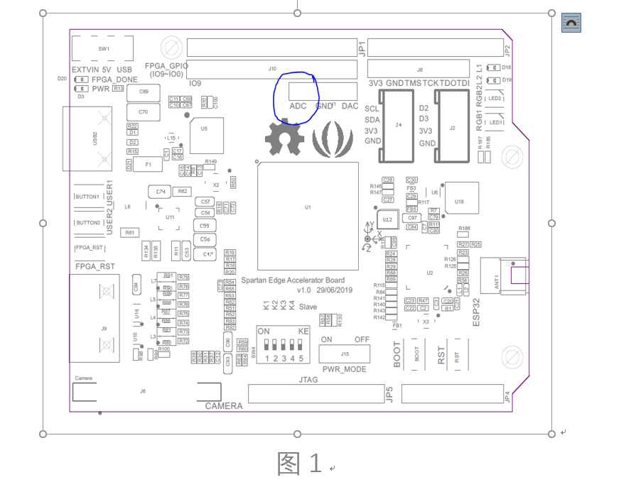
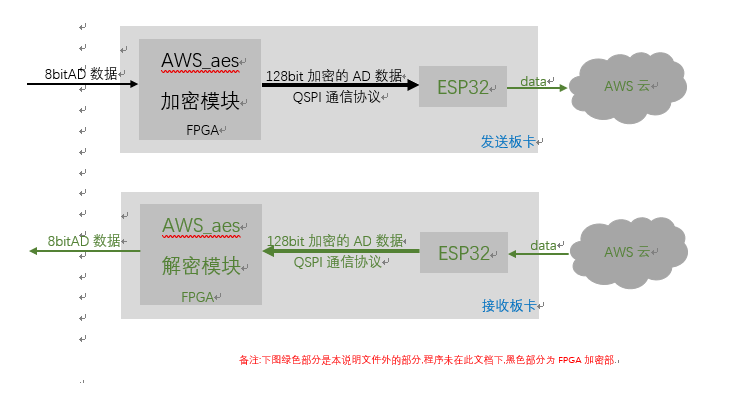

# AES加解密算法

## 概述

本设计主要功能是发送者将板卡ADC位置（见下图1蓝色圆圈标注位置）的输入数据进行aes算法的加密处理，加密密钥可以通过外部拨码开关随时变更。加密后的数据通过QSPI串行通信接口发送到ESP32。

后续处理是将ESP32读取的数据传输到AWS云端。这部分程序在ESP32上实现，本说明未加入详细叙述，请参考ESP32部分说明。

对应解密模块是将数据在AWS云上下载到接收者的ESP32上，在通过QSPI传输到FPGA进行解密，最后将揭解密据通过IO口输出出来。

## 项目总体架构

Vivado源码下载地址：https://pan.baidu.com/s/1crCyEjgbWyoZ2YVLHePOSQ