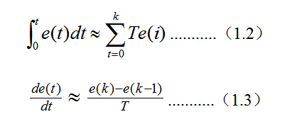
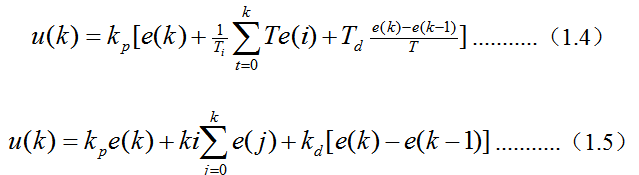
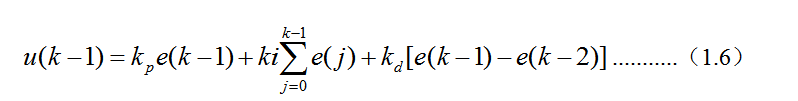
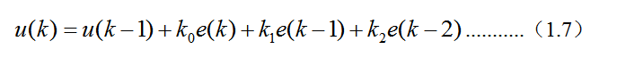
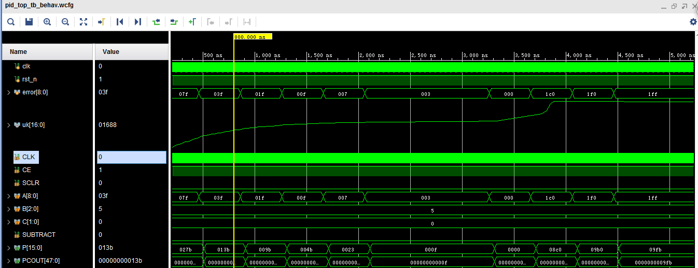

# PID算法在FPGA内的实现

##  PID算法数学理论推导

PID控制器的核心思想是针对控制对象的控制需求，建立描述对象动态特性的数学模型，通过PID参数整定实现在比例，微分，积分三个方面参数调整的控制策略来达到最佳系统响应和控制效果，PID算法的表达式：

 

注释：表一包含下文中所有公式变量及意义。

| u(t) | 输出控制量   |
| ---- | ------------ |
| kp   | 比例增益量   |
| Ti   | 积分时间常数 |
| Td   | 微分时间常数 |
| e(t) | 输入偏差     |
| T    | 采样周期     |
| k    | 采样序号     |
| ki   | kp*T/Ti      |
| kd   | kp*Td/T      |
| k0   | kp+ki+kd     |
| k1   | kp-2kd       |
| k2   | kd           |

在数字控制系统中，PID控制规律的实现必须用数值逼近的方法。当采样周期相当时，用求和代替积分、用后向差分代替微分，使模拟PID离散化变为差分方程。 
 

由公式1.1、1.2、1.3推导出如下公式：

 

由1.5、1.6推导出：

 

## PID算法架构

 

## Verilog HDL程序接口说明

clk :输入时钟信号，推荐50Mhz；

rst_n：复位信号；

error：误差信号，9位误差值，有r(k)和y(k)求差产生最高位为符号位；

uk：输出pid调整信号。

##  实现效果图

 

 那条模拟信号就是算法自动调节的过程  

源码下载地址：https://pan.baidu.com/s/1FDbJ0_L3GYyfMe4j61D1tQ

 

 

 

 

 

 

 

 

 

 

 

 

 

 

 

 

 

 

 

 

 

 

 

 

 

 

 

 

 