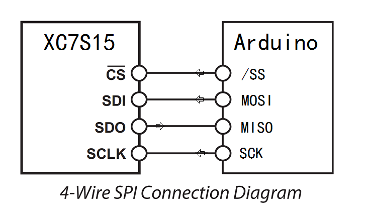

SPI2GPIO project
==================

  This is a sample FPGA project for Spartan Edge Accelerator Board conjunction with Arduino(UNO).  
  Provide GPIO/UART/ADC/DAC/RGB-LED functions, communication with Arduino(UNO) through SPI interface.

  
FPGA & Arduino(UNO) Connections
-------------------------------

  
Generate bitstream
------------------
  Install Xilinx Vivado on Windows,
  put the bin path of vivado into SYSTEM PATH,
  then run build.cmd.

  
Load bitstream to FPGA
----------------------
  Click [here](https://github.com/sea-s7/spartan-edge-esp32-boot)

  
Arduino(UNO) Demo
-----------------
This demo code run on Arduino(UNO), control the IO ports of FPGA(xc7s15).  
see [FPGAPortControl.ino](FPGAPortControl/FPGAPortControl.ino)

  
More Materials
--------------
  Click [here](detailed.md)
