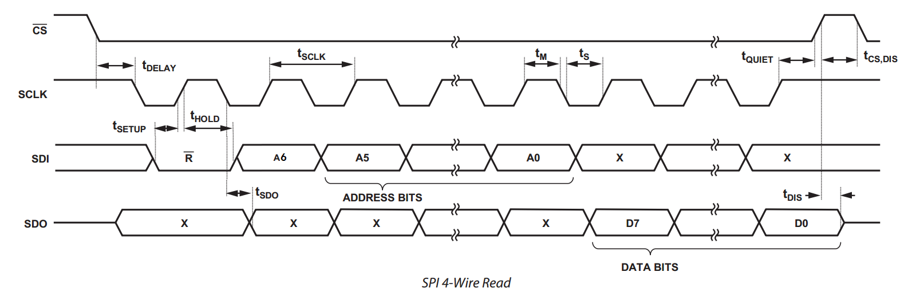
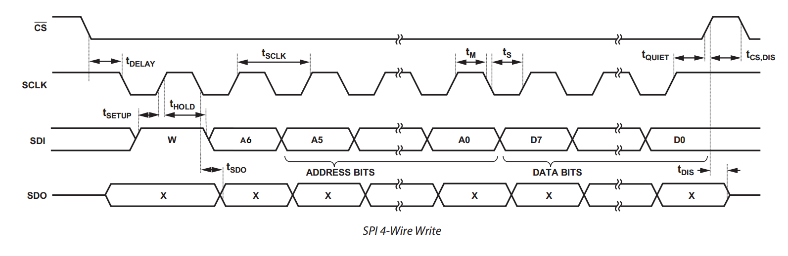

# SPI2GPIO

  
SPI Communication Protocol
--------------------------

  
Hardware Ports
--------------
<pre>
==============================================================================================
      FUNCTION  LOGIC            FPGA PIN          NET/ARDUINO              reserved/not-used
==============================================================================================
        SPI     gport_f[5]        H2                AR_D13   /SCK
                gport_f[4]        H1                AR_D12   /MISO
                gport_f[3]        B1                AR_D11   /MOSI
                spi_fss           B2                AR_D10   /SS             gport_f[2]
                rst_n             A2                AR_D9                    gport_f[1]

                gport_f[0]        B3                AR_D8
                gport_c[7]        A3                AR_D7
                gport_c[6]        A4                AR_D6
                gport_c[5]        B5                AR_D5
                gport_c[4]        A5                AR_D4
                gport_c[3]        B6                AR_D3
                gport_c[2]        A10               AR_D2
                                                    AR_D1    /TX
                                                    AR_D0    /RX

        IO      gport_a[0]        N14               FPGA_IO0
                gport_a[1]        M14               FPGA_IO1
                gport_a[2]        C4                FPGA_IO2
                gport_a[3]        B13               FPGA_IO3
                gport_a[4]        N10               FPGA_IO4
                gport_a[5]        M10               FPGA_IO5
                gport_a[6]        B14               FPGA_IO6
                gport_a[7]        D3                FPGA_IO7
                gport_b[0]        P5                FPGA_IO8
                gport_b[1]        E11               FPGA_IO9

        QSPI    gport_b[2]        L14               FPGA_QSPI_Q
                gport_b[3]        P2                FPGA_QSPI_D
                gport_b[4]        D13               FPGA_QSPI_HD
                gport_b[5]        J13               FPGA_QSPI_WP
                gport_d[4]        H14               FPGA_QSPI_CLK
                gport_d[5]        M13               FPGA_QSPI_CS

        LED     gport_b[6]        J1                FPGA_LED1
                gport_b[7]        A13               FPGA_LED2

        Button  gport_e[0]        M2                FPGA_K1
                gport_e[1]        L2                FPGA_K2
                gport_e[2]        L3                FPGA_K3
                gport_e[3]        K3                FPGA_K4
                gport_e[4]        C3                FPGA_USER1
                gport_e[5]        M4                FPGA_USER2
                gport_e[6]        D14               FPGA_RST

        ADC1173 gport_e[7]        J4                ADC1173./OE

        LSM6DS3TR
                gport_d[1]        J14               IMU_AD
                gport_d[2]        L12               IMU_INT2

        VERSION gport_z[0]        P4                VERSION_1
                gport_z[1]        P3                VERSION_2
                gport_z[2]        C14               VERSION_3

        AR_PWR  gport_z[3]        B11               AR_DET
                gport_d[3]        L13               AR_3V3_EN

        TXS0104E-0
                gport_z[6]        N4                FPGA_AR_OE1
        I2C __  gport_d[6]        P13               FPGA_ESP_SDA <- AR_SDA
            \_  gport_d[7]        P12               FPGA_ESP_SCL <- AR_SCL
        UART__  gport_c[0]        A12               FPGA_AR_D0   <- AR_D0
            \_  gport_c[1]        C12               FPGA_AR_D1   <- AR_D1

        TXS0104E-1
                gport_z[7]        M3                FPGA_AR_OE2
                gport_z[4]        K4                FPGA_AR_RESET<- AR_RESET
        SPI__   spi_clk           H13               FPGA_AR_SCK  <- AR_SCK
           |_   spi_in            M5                FPGA_AR_MOSI <- AR_MOSI
           \_   spi_out           L5                FPGA_AR_MISO <- AR_MISO

        DG2788A gport_z[5]        H3                FPGA_ESP_IN12

        SK6805  sk6805_do         N11               FPGA_RGB
</pre>

  
SPI Registers
-------------
<pre>
  * 0x00  - GPA_OE    port A output enable, 1 for output, 0 for input
  * 0x01  - GPA_ODATA port A output data
  * 0x02  - GPA_IDATA port A input  data

  * 0x04  - GPB_OE    port B output enable, 1 for output, 0 for input
  * 0x05  - GPB_ODATA port B output data
  * 0x06  - GPB_IDATA port B input  data

  * 0x08  - GPC_OE    port C output enable, 1 for output, 0 for input
  * 0x09  - GPC_ODATA port C output data
  * 0x0A  - GPC_IDATA port C input  data
  * 0x0B  - GPC_ALT   port C alternate function control,
            bit 0x01  UART_TX alternate, 1 for UART_TX, 0 for GPORT_C[0]
            bit 0x02  UART_RX alternate, 1 for UART_RX, 0 for GPORT_C[1]
            bit 0xFC  reserved

  * 0x0C  - GPD_OE    port D output enable, 1 for output, 0 for input
  * 0x0D  - GPD_ODATA port D output data
  * 0x0E  - GPD_IDATA port D input  data

  * 0x10  - GPE_OE    port E output enable, 1 for output, 0 for input
  * 0x11  - GPE_ODATA port E output data
  * 0x12  - GPE_IDATA port E input  data

  * 0x14  - SK6805_CTRL sk6805 control
            bit 0x07  color address 0 - 5 (B0, R0, G0, B1, R1, G1)
            bit 0xF8  reserved
  * 0x15  - SK6805_DATA color data

  * 0x16  - DAC_DATA0 DACx311 low  8-bits(DB7  - DB0),
            written to initiate a conversion/transfer
  * 0x17  - DAC_DATA1 DACx311 high 8-bits(DB15 - DB8),
            prepare high 8-bits to transfer only.

  * 0x18  - UART_DATA, UART receiving & transmit
  * 0x19  - UART_STAT, UART state
            bit 0x10 transmit busy
            bit 0x01 data buffer with valid data

  * 0x1C  - GPZ_OE    port Z output enable, 1 for output, 0 for input
  * 0x1D  - GPZ_ODATA port Z output data
  * 0x1E  - GPZ_IDATA port Z input  data

  * 0x1F  - ADC_DATA  adc1173 reading value

  * 0x20  - GPF_OE    port F output enable, 1 for output, 0 for input
  * 0x21  - GPF_ODATA port F output data
  * 0x22  - GPF_IDATA port F input  data
</pre>
